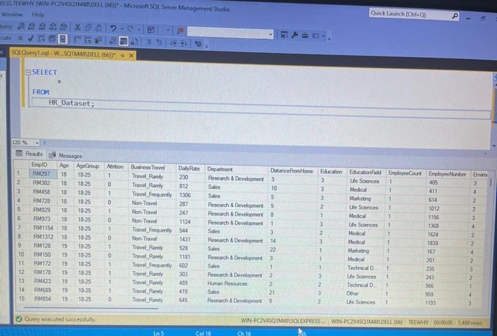
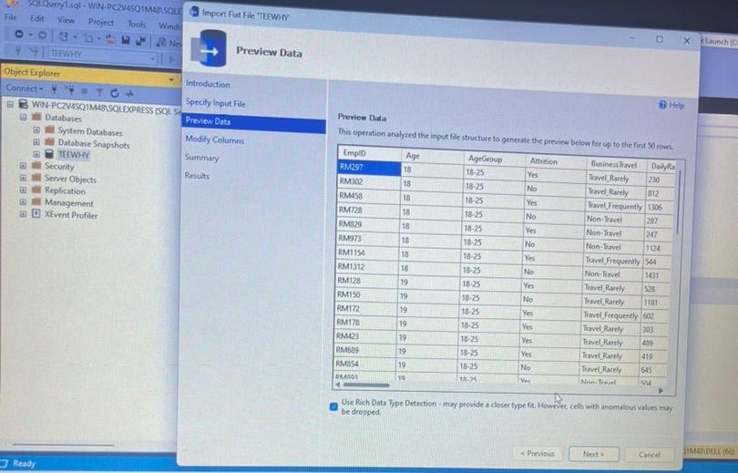
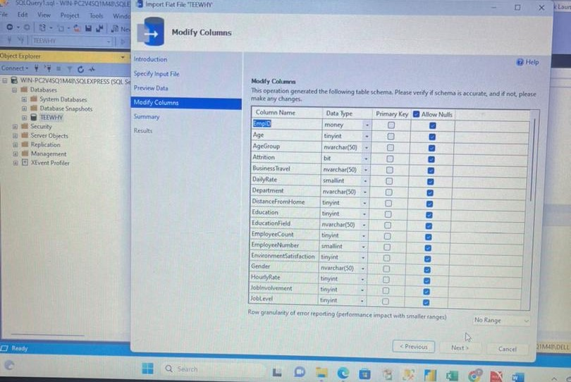
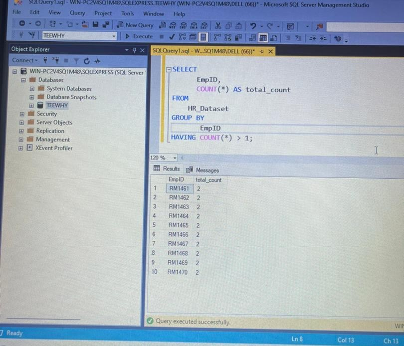
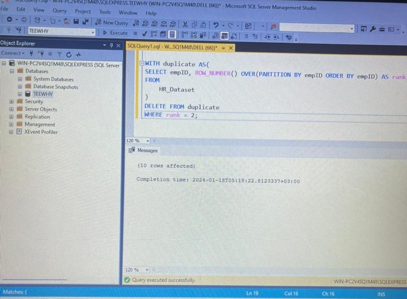

Attrition-Analysis

## Analysis on Employee Attrition Using SQL 

## Introduction 

This is a SQL (Structured Query Language) project for attrition. Attrition is simply mean when an employee leaves the company by way of voluntary resignation due to professional or personal reasons, and the vacant position cannot be replaced immediately. So this project aims to delve deeply into the major factors resulting in employee attrition and explore how organizations can best mitigate these issues to improve the quality of life for every employee and increase employee retention rates.

As a diligent data analyst, I delved into the HR dataset on attrition, eager to unveil the stories embedded within the numbers. I delved into demographics, examining employees in age groups between 18-25, 26-35, 36-45, 46-55, and 55+.

## Data Source 

The HR dataset was gotten from Kaggle.com. as CSV file 
The dataset has 38 columns with 1480 records which comparises of EmmployeeID, Age, AgeGroup, Attrition, BussinessTravel, DailyRate, Department, DistanceFromHome, Education, EducationField, and many more.

### The raw dataset
 

## Data Cleaning 

To ensure data integrity and consistency, after i imported the data from Microsoft Excel as CSV file, I had to clean the dataset by assigning the correct data type to every column. I ran a query to investigate duplicates in the employee_id and found that there were 10 duplicate rows, which I removed to ensure accurate analysis.. 

,   , 

## Objective 

The purpose of this project is to analyze and uncover the stories embedded in the numbers within the HR dataset. It aims to extract useful information and insights to support decision-making on how employers and organizations can improve the quality of the work environment, prioritize employee welfare and mental health, and ultimately reduce attrition rates while increasing employee retention.

## Problem Statement 

1. What are the major causes of Attrition in an Organization
2. How can attrition be Mitegated in an Organization
3. Are there specific departments or job roles more susceptible to attrition, and if so, why?
4. How does employee satisfaction with compensation and benefits correlate with attrition?

## Skills Demostracted 

The following Power BI were Incorporated

- Data cleaning
- Power query editor
- Dax
- Slicer
- Data Storytelling 
- Data Visulization

