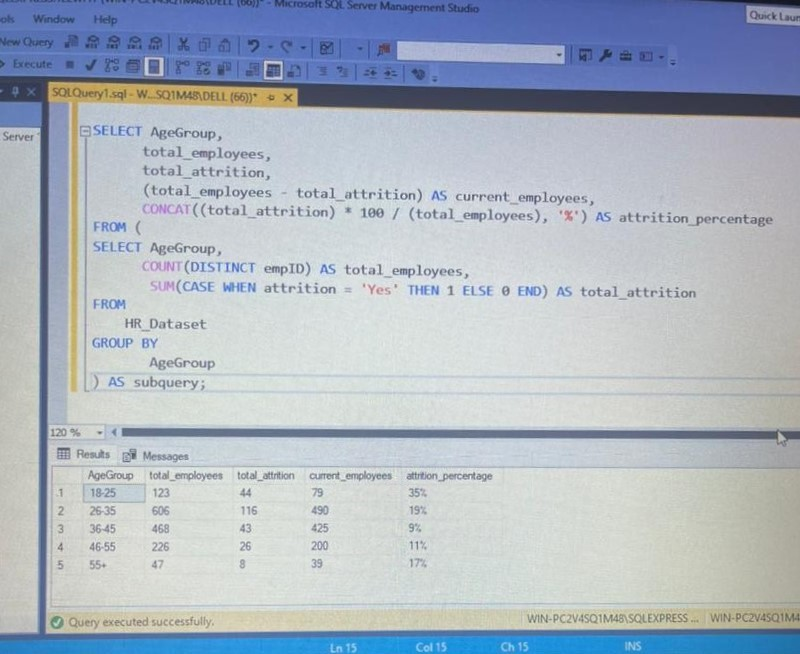

Attrition-Analysis

## Analysis on Employee Attrition Using SQL and POWER BI

## Introduction 

This is a comprehensive SQL (Structured Query Language) and POWER BI project for employee attrition. Attrition is simply mean when an employee leaves an organization by way of voluntary resignation due to professional or personal reasons, and the vacant position cannot be replaced immediately. So this project aims to delve deeply into the major factors resulting in employee attrition and explore how organizations can best mitigate these issues to improve the quality of life for every employee and increase employee retention rates.

As a diligent data analyst, I delved into the HR dataset on attrition, eager to unveil the stories embedded within the numbers. I delved into demographics, examining employees in age groups between 18-25, 26-35, 36-45, 46-55, and 55+.

## Data Source 

The HR dataset was gotten from Kaggle.com as CSV file. 
The dataset has 38 columns with 1480 records which comparises of EmmployeeID, Age, AgeGroup, Attrition, BussinessTravel, DailyRate, Department, DistanceFromHome, Education, EducationField, and many more.

### The raw dataset
 

## Data Cleaning 

To ensure data integrity and consistency, after i imported the data from Microsoft Excel as CSV file, I had to clean the dataset by assigning the correct data type to every column. I ran a query to investigate duplicates in the employee_id and found that there were 10 duplicate rows, which I removed to ensure accurate analysis.. 

,   , 

## Objective 

The purpose of this project is to analyze and uncover the stories embedded in the numbers within the HR dataset. It aims to extract useful information and insights to support decision-making on how employers and organizations can improve the quality of the work environment, prioritize employee welfare and mental health, and ultimately reduce attrition rates while increasing employee retention.

## Problem Statement 

1. Which Age-Group is more likely to leave the Organization
2. What are the major causes of Attrition in an Organization
3. How can attrition be Mitegated in an Organization
4. How does employee satisfaction with compensation and benefits correlate with attrition?

## Skills Demostracted 

The following Power BI and SQL were Incorporated

- Data cleaning
- Power query editor
- Dax
- Slicer
- Data Storytelling 
- Data Visulization

## Analysis

Having delved into the HR dataset, the organization has employed a total number of 1,470 employees over the years. The age group between 18-35 accounts for about 48% of total employees and also has the highest attrition. This shows that the organization has a substantial, relatively young, and early-career employee base. The fact that the 18-35 age group has the highest attrition suggests that employees within this age range are more likely to leave the organization compared to other age groups.

## Attrition BY Age-Groups

The age group between 18-25 and 26-35 has the highest attrition rate of 35% and 19% respectively. This is a significant finding and indicates that employees in this early career stage are more likely to leave the organization. Surprisingly, the 55+ age group, which accounts for less than 6% of the total employees, has an attrition rate of 17%. Despite being a smaller percentage of the workforce, the attrition rate is noteworthy, and the departure of 8 people out of 47 is relatively impactful. 

The age group between 36-45 accounts for a moderate attrition rate of 9%. This shows that employees in the mid-career stage are relatively more stable in their positions compared to younger counterparts. The age group between 46-55 has an attrition rate of 11%. This is somewhat higher than the mid-career group (36-45) but lower than the early career stages (18-25 and 26-35)

## Major causes of Attrition in an Organization

It is evident that there are several significant causes of attrition in today's organizations. Employers and organizations must pay adequate attention to these factors and make informed decisions to address them, in order to reduce the attrition rate and enhance retention. After my careful analysis of the HR dataset, I looked into various metrics and variables and discovered that job satisfaction, job level, marital status, low salary, and work-life balance are some of the major causes of the attrition rate. Let's delve deeper into these key findings.

## Insight 

- Employee satisfaction with their roles and overall work experience is a crucial factor influencing attrition. Dissatisfaction can lead to a higher likelihood of employees seeking alternative opportunities.

- Employees at certain levels may be more prone to leaving, whether due to limited advancement opportunities or other job-related factors.

- Compensation is a critical aspect affecting employee satisfaction and retention. Salary below  industry standards or employee expectations can lead to increased attrition rates.

- The balance between work and personal life is another key determinant. Employees who perceive an imbalance may be more inclined to seek employment elsewhere, that offer a healthier work-life.

- And lastly, marital status appears to be a contributing factor to attrition. Employees with a single marital status and within the 18-35 age group account for 50.63% of overall attrition. This is a significant rate; further analysis needs to be done in correlation with other variables.

## Visualization 

### This is the dashboard I created for the overall employee attrition, featuring various metrics and variables
 

## Feel free to interact with the report and analyze the data at your convenience [here](https://app.powerbi.com/view?r=eyJrIjoiOGMxNjk0MzktMGNiNy00ZDdkLWE2ZWQtNDg1MTNmMThmNTg1IiwidCI6ImMzYmI4OWM0LWE2MzItNDU1NC04YTlhLWVlNTI4NTI5NDc1NSJ9)

## Recommendation

- It's essential that organizations implement strategies to boost job satisfaction, including regular feedback sessions and career development opportunities.

- It's also important that employers provide clear paths for career progression, addressing concerns related to job levels and advancement opportunities within an organization.

- Organizations need to conduct regular reviews of salary structures to ensure competitiveness in the market and fair compensation for employees.

- Lastly, employers need to consider offering flexible work arrangements to promote and enhance a healthier work-life balance and overall job satisfaction.

## Conclusion 

By addressing the identified causes of attrition and implementing the recommendations provided above, organizations can create a more conducive work environment, fostering employee satisfaction and ultimately reducing employee turnover rates. This strategy contributes not only to immediate retention but also to the long-term health and success of the organization.

  

                                                   

